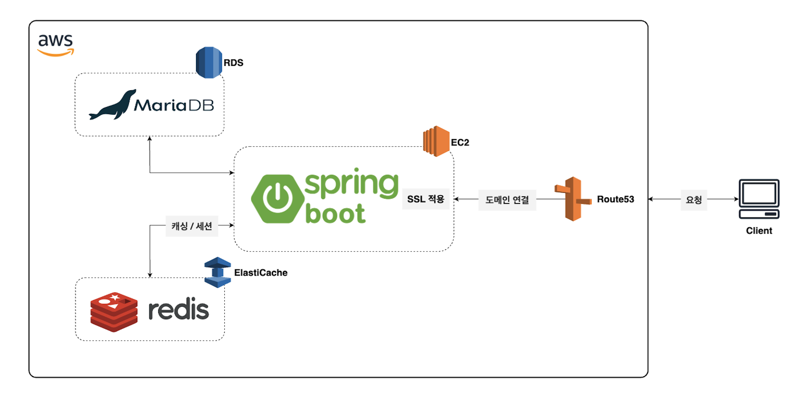

# TODO-LIST

  

## 📖 프로젝트 소개

- Spring Boot, JSP, MariaDB(MyBatis)를 이용했으며 기능 구현과 배포 경험을 위한 게시판 프로젝트입니다.
- 게시글을 작성 하고 댓글을 달며 소통이 가능합니다.
- 게시판을 이용할 때 관리자 / 사용자로 구분하여 기능을 제공합니다.
- 등급에 따라 게시판 이용 기능이 제공되고 관리자에 의해 이용 기능을 조정할 수 있습니다.

- [Yboard 바로가기](https://www.yboard.site)
    - 테스트 사용자 계정
        - testuser
        - test1234
    - 관리자 계정 : 문의

---

## 🛠️ 기술 스택

### Back-end

- Language : Java17
- FrameWork : SpringBoot 3.3.2
- DataBase : MariaDB, MyBatis, Redis

### Front-end

- Language & Library : HTML/CSS, JavaScrpit, JSP, JQuery, BootStrap(Berry React Material Admin Dashboard Template)

### Server

- Apache Tomcat 10.0

### Hosting

- AWS : EC2(Ubuntu), RDS(MariaDB), ElastiCache(Redis), Route53

## ⭐️ 주요 내용

### [사용자] - 로그인/회원가입

- 이메일 인증을 통한 본인확인, 사용자 주소 입력, 회원가입에 대한 폼 로그인
- OAuth2.0 을 통한 소셜 로그인 (Google, Naver, KaKao)
- 비밀번호 5회 오류 시 계정 잠금
- Spring Security Remember-me 를 통한 로그인 유지
- Spring Security Session Management 를 통한 중복로그인 제어(Redis 를 이용한 세션 클러스터링)

### [사용자] - 등급

- LEVEL0(비로그인) : 게시글 조회
- LEVEL1(회원) : 게시글 조회, 댓글 작성, 좋아요/싫어요
- LEVEL2(등업) : 게시글 조회, 게시글 작성, 댓글 작성 좋아요/싫어요 (자동등업 - 관리자 지정 포인트)
- Sheduler 를 통한 포인트 지급(출석, 일일 댓글), 자동 등업, 등급에 따른 포인트 지급
- 게시글 홈페이지 오늘의 유저(Redis 를 이용한 캐싱), 상위 랭킹 조회

### [사용자] - 게시글

- 게시판 종류에 따른 분류 (갤러리 게시판 : 썸네일 이미지 업로드 / 일반 게시판)
- 게시글 설정따른 비공개 게시글 설정 / 게시글 임시저장
- 게시글 목록 조회 시 검색, 정렬, 페이징
- 댓글 채택

### [사용자] - 댓글, 좋아요/싫어요

- 게시판 설정에 따른 댓글 이미지 업로드
- 대댓글 작성 : 최대 5 Depth 까지 댓글에 대한 대댓글 작성
- 게시글 및 댓글에 좋아요/싫어요

### [관리자] - 게시판 관리

- 사용자가 게시글을 쓸 수 있는 게시판 생성에 대한 관리
- 게시판 기본 설정 (이름, 종류, 순서, 카테고리, 공지사항 지정)
- 게시판 권한 설정(이미지 업로드 제한, 접근 허용 등급 지정, 이미지, 댓글 제한, 상태)

### [관리자] - 게시글 관리

- 게시판 별 게시글 목록 조회
- 게시글에 대한 조회와 상태 관리(활성화/비활성화 상태 변경)
- 게시글 추가를 통한 공지사항 게시글 작성

### [관리자] - 댓글 관리(개발 중)

- 게시판 별 댓글 목록 조회
- 댓글에 대한 조회와 상태 관리(활성화/비활성화 상태 변경)

### [관리자] - 사용자 관리(개발 중)

- 회원가입한 사용자에 대한 목록 조회
- 사용자 상태 관리(활성화/비활성화 상태 변경)
- 사용자 랭킹 조회 및 등급변경, 포인트 지급

### [관리자] - 신고 관리(개발 중)

- 사용자에 의한 신고 목록 조회
- 게시글, 댓글 상태 관리(신고내역에 따른 신고처리 / 상태 변경)
- 신고 처리에 대한 사용자 알림

## 📖 인프라

## 📖 ERD

## 🎥 Preview

### 사용자 : 회원가입 로그인

|  |  |
|--------------------------------------------------------------------------------------------------|-------------------------------------------------------------------------------------------------|

### 사용자 : 게시글(등록, 수정/삭제)

|  |  |
|-----------------------------------------------------------------------------------------------|------------------------------------------------------------------------------------------------|

### 사용자 : 게시글(임시저장 / 게시)

|  |  |
|-----------------------------------------------------------------------------------------------------|------------------------------------------------------------------------------------------------|

### 사용자 : 좋아요/싫어요, 댓글(댓글 등록/수정/삭제 | 좋아요/싫어요/댓글채택)

|  |  |
|-----------------------------------------------------------------------------------------------|-------------------------------------------------------------------------------------------------|

### 관리자 : 게시판 관리 / 게시글 관리

|  |  |
|-------------------------------------------------------------------------------------------------------|--------------------------------------------------------------------------------------------------------|